# 🌪️ 풍력 발전기 스마트 예방 정비 시스템

---

## 1. 📁 데이터셋 구축 및 전처리

풍력 터빈 블레이드 이미지와 YOLO 형식 라벨을 수집한 뒤, 학습·검증용으로 무작위 분할했습니다. 이미지와 라벨은 파일명(stem) 기준으로 1:1 매칭하여 이동했으며, 라벨이 없는 배경 이미지도 동일한 비율로 분할에 포함했습니다.

### Train / Val 분할 결과

<!-- report:auto:split -->
- **자동 반영:** 2026-07-02 07:04:39 (`folder_scan`)

| 항목 | 이미지 수 | 비율 |
| :--------------- | ----------: | ----: |
| **전체 (Total)** | **13,470장** | 100% |
| **Train (학습)** | **10,776장** | 80.0% |
| **Val (검증)** | **2,694장** | 20.0% |

**데이터 구성**

| 구분 | Train | Val | 합계 |
| :--- | ---: | ---: | ---: |
| **라벨 있음** (객체 BBox) | 2,401 | 594 | 2,995 |
| **배경** (라벨 없음, negative) | 8,375 | 2,100 | 10,475 |

- **분할 비율:** 약 **8 : 2** (Train : Val), seed=—
- **분할 방식:** 랜덤 셔플 후 8:2 분할 (`split_data.py`)
- **평가 세트:** Test 세트는 별도로 두지 않음 — **Val 세트**로 최종 성능 평가
<!-- /report:auto:split -->

- **저장 경로:**
  - `data/images/train`, `data/images/val`
  - `data/labels/train`, `data/labels/val`

### EDA 및 시각화 (Exploratory Data Analysis)

> 학습 전 데이터 특성 파악 — `python eda.py` 실행 후 `update_report.py` / `update_notion.py`로 자동 반영

<!-- report:auto:eda -->
- **자동 반영:** 2026-07-02 07:04:39
- **총 BBox:** 9351개

**클래스별 BBox 분포**

| 클래스 | BBox 수 | 비율 | 극소형 비율 (w,h < 0.2) |
| :--- | ---: | ---: | ---: |
| **Dirt (0)** | 581 | 6.21% | 5.68% |
| **Damage (1)** | 8770 | 93.79% | 93.34% |

**주요 인사이트**

- 클래스 불균형: Damage (1) 8770개 vs Dirt (0) 581개 (약 15.1배).
- Damage (1) BBox의 93.3%가 width·height 모두 0.2 미만(극소형 객체).
- Damage 클래스가 이미지 대비 매우 작은 BBox로 밀집 → imgsz 1024 이상 상향 또는 소형 객체 탐지 증강 검토 권장.

**시각화**

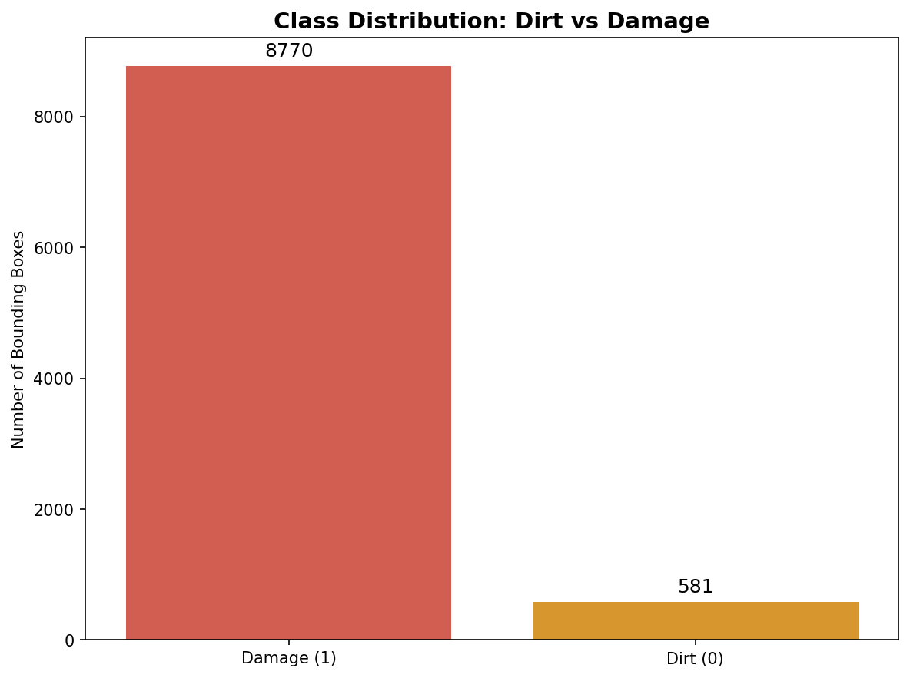
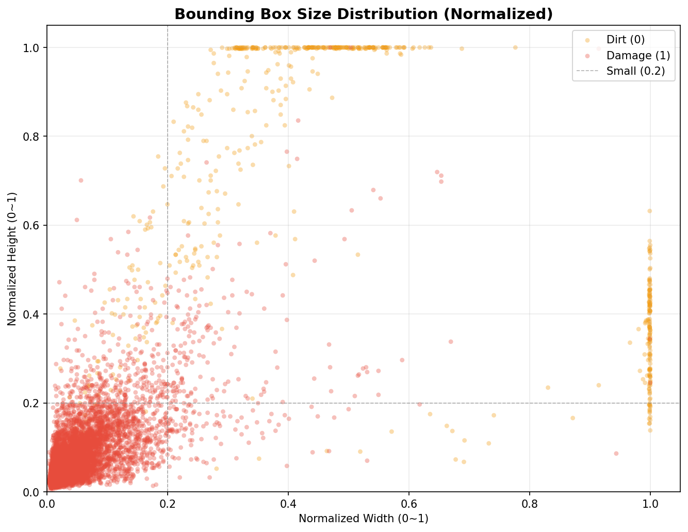
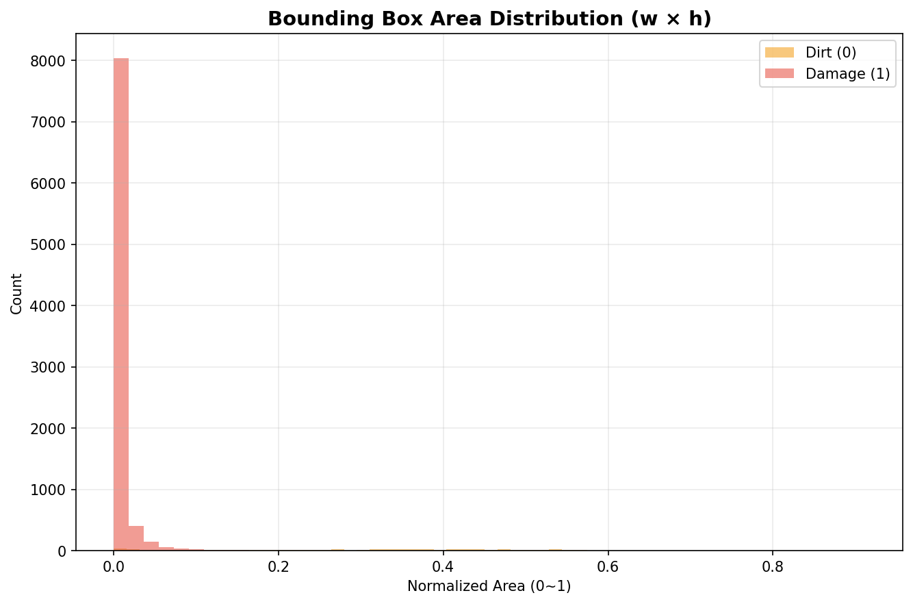
<!-- /report:auto:eda -->

---

## 2. 📊 훈련 결과 및 베이스라인 비교군 분석

> **루브릭 1:** 데이터셋 및 선택한 모델이 관련 분야의 베이스라인 모델과 비교하여 어떤 차이가 있는지 정량적, 정성적 분석 진행

### [정량적 분석] 베이스라인 vs 최종 모델 성능 비교

| 구분          | 사용 모델       | Epoch | mAP50 | mAP50-95 | 비고                            |
| :------------ | :-------------- | :---- | :---- | :------- | :------------------------------ |
| **Baseline** | YOLO11n (Nano) | 18 | 0.538 | 0.317 | Baseline Nano 학습 |
| **최종 모델** | YOLO11s (Small) | 50 | 0.575 | 0.319 | 본학습 best |
| **성능 향상** | - | - | **+ 3.7%p** | **+ 0.2%p** | Baseline 대비 개선 |

### [정성적 분석]

<!-- report:auto:run-summary -->
- **최종 학습:** `train` | mAP50 **0.575** | mAP50-95 **0.319**
- **재검증:** `val_final`
- **Val 메트릭:** mAP50 **0.574** | Precision **0.597** | Recall **0.640**
- **갱신 시각:** 2026-07-02 07:04:39
<!-- /report:auto:run-summary -->

- **Baseline 한계:** 작은 크기의 Damage(손상) 객체를 배경과 혼동하여 놓치는(False Negative) 현상이 잦았음.
- **최종 모델 개선점:** 모델 사이즈를 Small로 키우고 HSV·Mosaic 등 도메인 맞춤 증강을 적용한 결과, 미세한 블레이드 스크래치까지 명확하게 잡아내는 것을 육안으로 확인함.

---

## 3. 🧪 다양한 실험 및 성능 개선 기법 (Experiment Logs)

> **루브릭 2:** 모델의 조정 및 성능 개선 기법을 통해 분기된 훈련 결과의 성능 평가 비교

목표 성능 달성을 위해 Baseline 대비 아래 **3단계 개선(EXP 1~3)** 을 설계·적용하고, 최종 통합 설정(`configs/train.yaml`)으로 본학습을 수행했습니다.

> EXP 1~3은 각각 **독립 rerun** 이 아니라, 최종 모델에 누적 반영한 설계 변경입니다. Baseline(YOLO11n)만 별도 학습으로 비교합니다.

### [실험별 성능 비교]

<!-- report:auto:exp-comparison -->
| 실험 | 모델 | Epoch | mAP50 | mAP50-95 | 비고 |
| :--- | :--- | ---: | ---: | ---: | :--- |
| **Baseline** | YOLO11n (Nano) | 18 | 0.538 | 0.317 | 초기 기본 학습 (Nano) |
| **EXP 1** | YOLO11s (Small) | 50 | 0.575 | 0.319 | Small 스케일업 |
| **EXP 2** | YOLO11s (Small) + Aug | 50 | 0.575 | 0.319 | 도메인 증강 적용 |
| **EXP 3** | YOLO11s (Small) + Tuned | 50 | 0.575 | 0.319 | Epoch 50 · Batch 8 · Patience 10 |
<!-- /report:auto:exp-comparison -->

- **EXP 1: 모델 아키텍처 스케일업 (Nano vs Small)**
  - **내용:** 온디바이스(드론) 탑재를 고려하여 가장 가벼운 Nano를 썼으나, 풍력 발전기의 미세 균열 탐지를 위해 파라미터가 조금 더 많은 Small 모델로 스케일업 실험.
  - **결과:** 추론 속도(FPS) 저하는 미미한 반면, mAP 지표가 크게 상승하여 Small 모델로 최종 채택.
- **EXP 2: Data Augmentation (데이터 증강) 적용**
  - **내용:** 해상 풍력 터빈 특성(안개, 흐린 날씨, 빛 반사) 반영 — HSV 밝기/채도 변화, 좌우 Flip(`fliplr`), Mosaic·Mixup·Random Erasing 적용. 블레이드 방향 특성상 **상하 반전(flipud=0) 금지**.
  - **결과:** 과적합(Overfitting)이 방지되고 검증(Val) Loss가 안정적으로 수렴함.
- **EXP 3: 하이퍼파라미터 튜닝 (Epoch 및 Batch Size)**
  - **내용:** Epoch 50, Patience 10으로 충분한 학습과 과적합 방지를 설정. M1 16GB 환경에서 batch 32는 OOM·스왑 발생 → **batch 8**으로 안정 학습.
  - **결과:** 50 epoch까지 수렴하여 Val mAP50 **0.574** 달성 (`val_final`). Early stopping은 설정했으나 50 epoch 내 최적점이 유지됨.

---

## 4. 📈 적합한 로스와 메트릭 평가 및 시각화

> **루브릭 3:** 데이터셋 구성, 모델 훈련, 결과물 시각화 사이클 수행 및 평가지표에 따른 모델 평가

### 평가 지표 (Metrics & Loss) 분석

- **사용 지표:** 객체 탐지(Object Detection)의 글로벌 표준 지표인 **mAP50**, **mAP50-95**, **Precision**, **Recall** 사용.
- **평가 세트:** Test 세트 없음 — 학습에 사용하지 않은 **Val 세트**(`val.py` → `val_final`)로 최종 평가.
- **학습 환경:** Apple M1 Pro (`device: mps`), `imgsz: 640`, batch 8, workers 0, seed 42
- **Box Loss & Class Loss:** Train Loss와 Val Loss가 모두 안정적으로 우하향하는 그래프를 확인하여 학습이 정상적으로 이루어졌음을 검증함.
<!-- report:auto:metrics-visuals -->
- **자동 반영:** 2026-07-02 07:04:39
- **Val 재검증 (`val_final`):** mAP50 **0.574** | mAP50-95 **0.318** | Precision **0.597** | Recall **0.640**

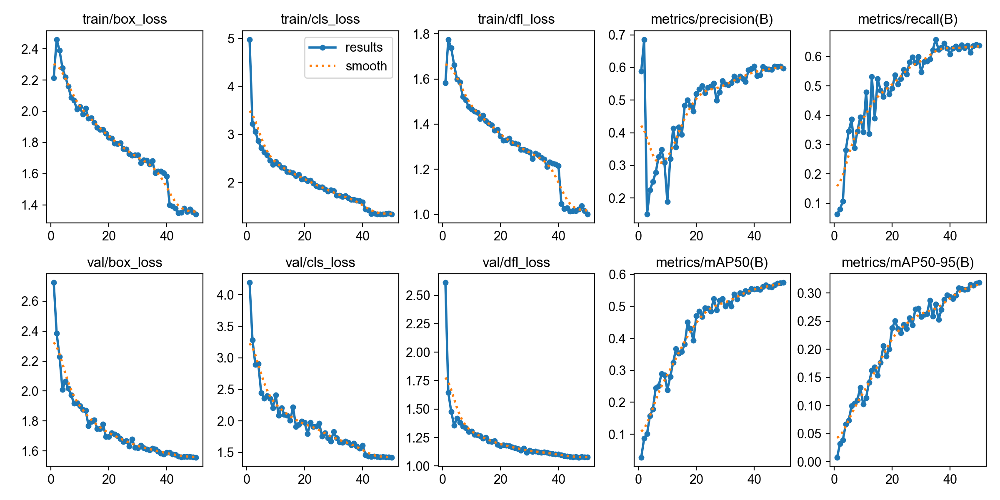

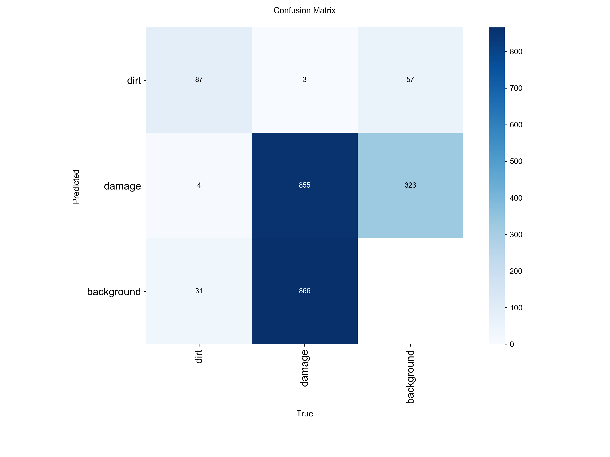

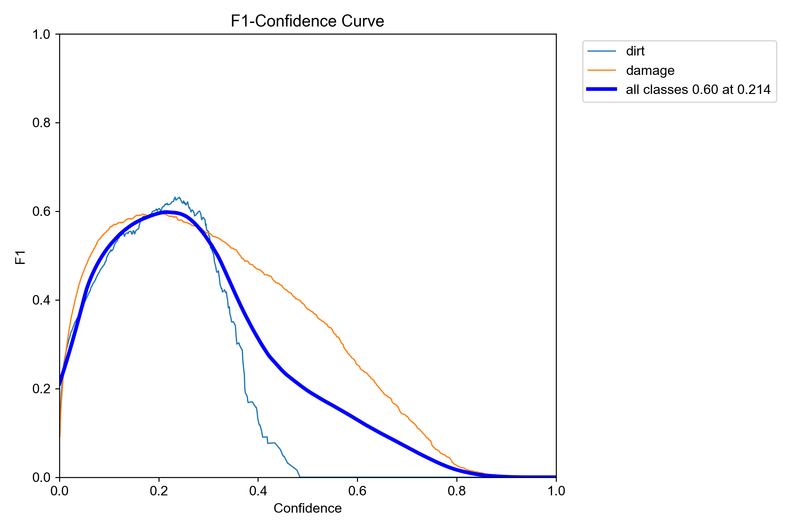
<!-- /report:auto:metrics-visuals -->

### Phase 1 Test — predict.py Val 일괄 추론

<!-- report:auto:predict-inference -->
- **자동 반영:** 2026-07-02 06:56:42 (`predict.py` → `val_batch`)
- **가중치:** `runs/detect/train/weights/best.pt` | conf **0.25** | device `mps`
- **입력:** `data/images/val`

> **Val 공식 평가(`val.py`)와 별도** — best.pt로 Val 전체에 추론만 수행한 Phase 1 Test 결과입니다.

**Val 일괄 추론 집계**

| 항목 | 값 |
| :--- | ---: |
| **처리 이미지 수** | 2,694 |
| **탐지 있는 이미지** | 505 (18.7%) |
| **탐지 없음** | 2,189 |
| **총 BBox** | 1,294 |

**클래스별 탐지 수**

| 클래스 | BBox 수 |
| :--- | ---: |
| **Damage** | 1,164 |
| **Dirt** | 130 |

**대표 추론 결과 (탐지 있음)**

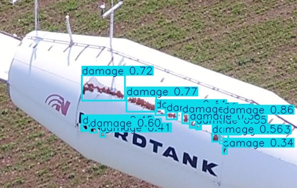
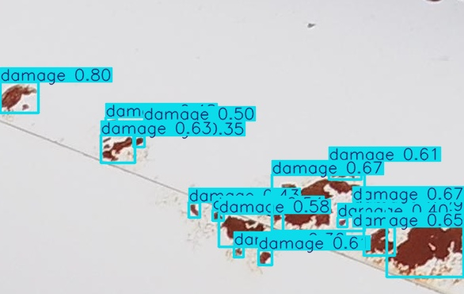
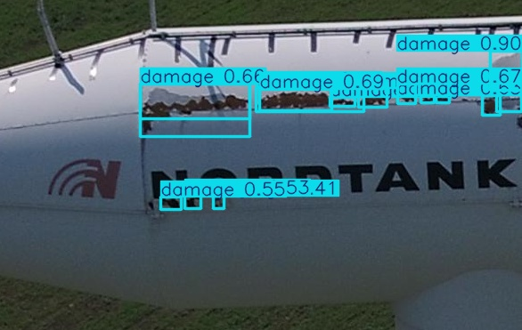

- **전체 결과:** `runs/predict/val_batch/predictions.json` · `runs/predict/val_batch/`
<!-- /report:auto:predict-inference -->

### 탐지 결과 시각화 (val.py 검증)

<!-- report:auto:predictions -->

- **Dirt(오염) 및 Damage(손상) 탐지 결과** — `val_final`

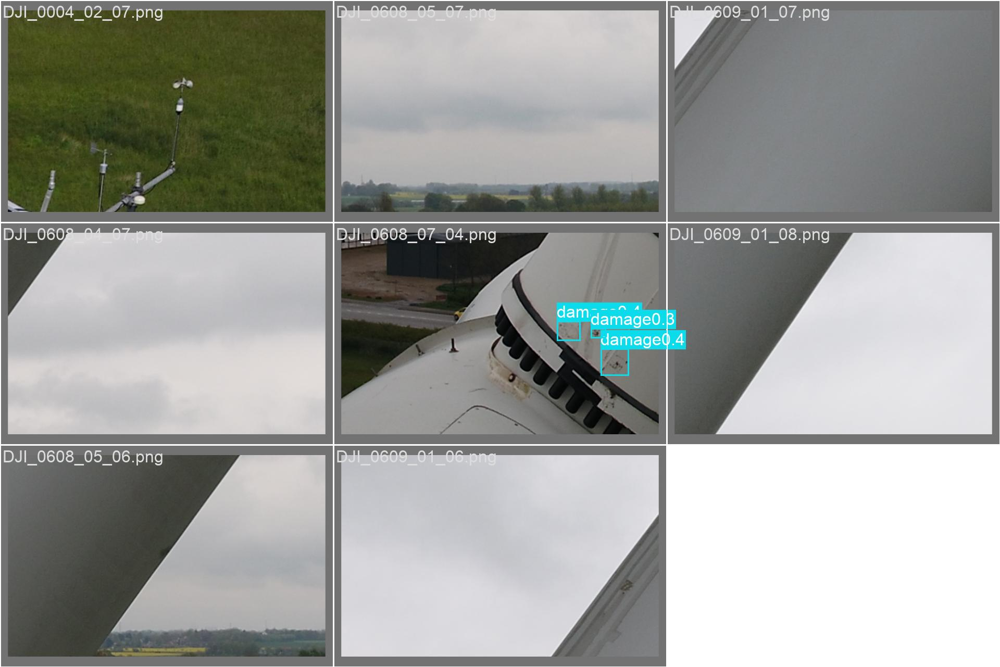

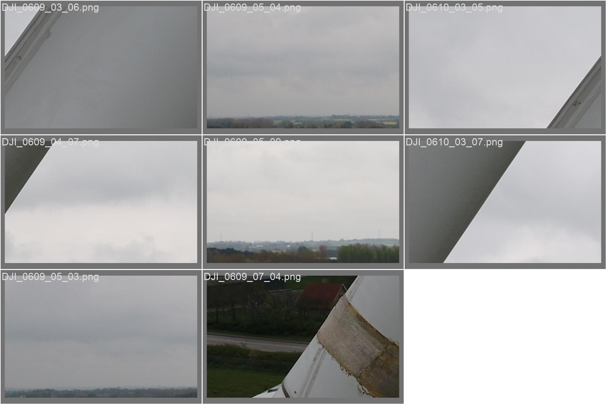

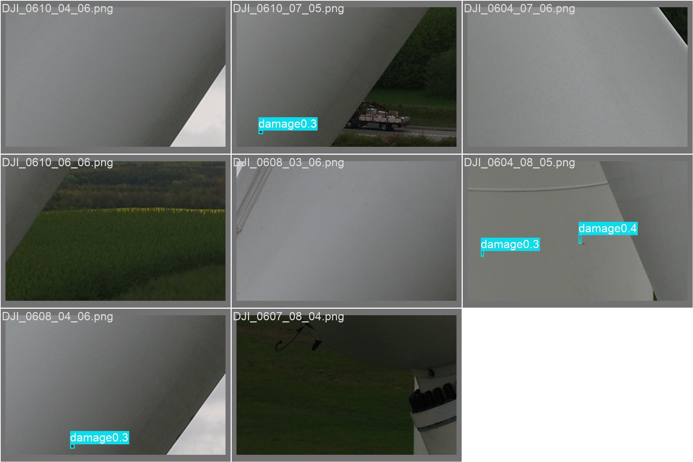

<!-- /report:auto:predictions -->

- **평가 (`val.py`):** 드론 촬영과 동일한 도메인의 **Val 검증 이미지**에서 Dirt·Damage를 분리 탐지하는 것을 확인함. (별도 Test 세트 미구분)
- **평가 (`predict.py`):** Val **전체**에 `best.pt` 추론 파이프라인(Phase 1 Test)을 적용하여 BBox·JSON 산출을 검증함.
