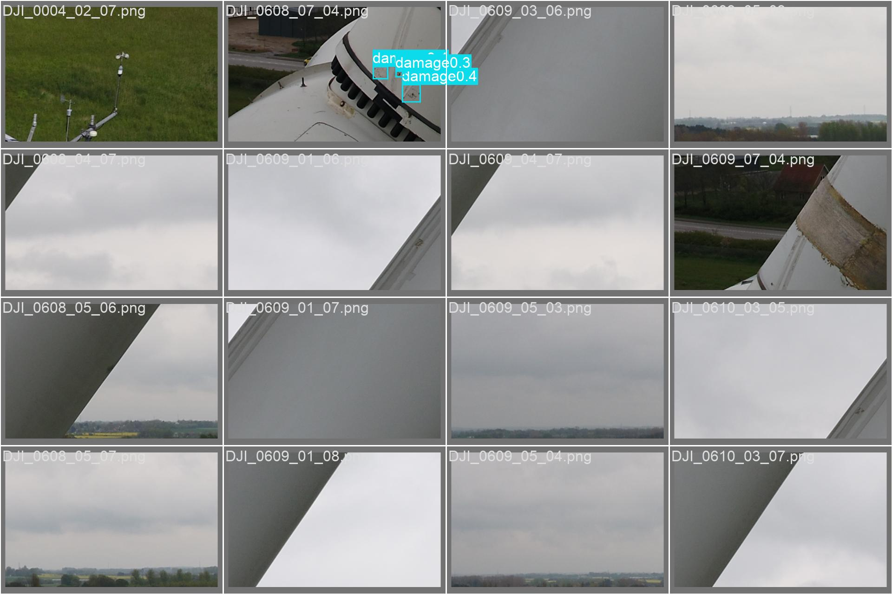
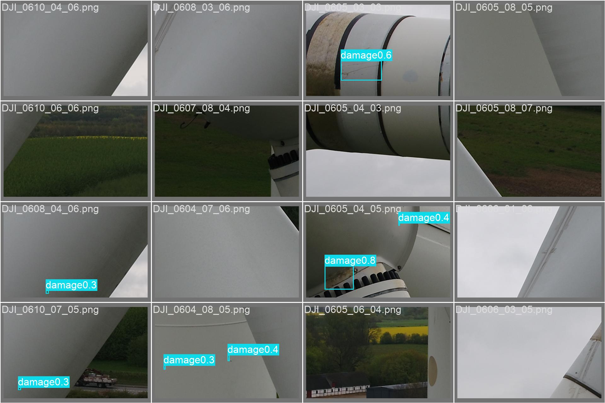
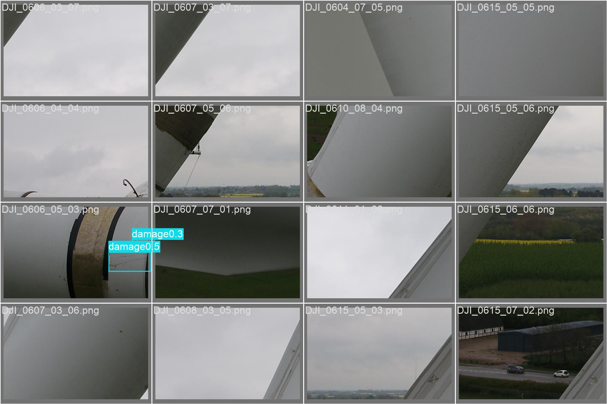

# 🌪️ 풍력 발전기 스마트 예방 정비 시스템 (YOLOv8)

---

## 0. 📁 데이터셋 구축 및 전처리

풍력 터빈 블레이드 이미지와 YOLO 형식 라벨을 수집한 뒤, 학습·검증용으로 무작위 분할했습니다. 이미지와 라벨은 파일명(stem) 기준으로 1:1 매칭하여 이동했으며, 라벨이 없는 배경 이미지도 동일한 비율로 분할에 포함했습니다.

### Train / Val 분할 결과

| 항목 | 이미지 수 | 비율 |
| :--- | ---: | ---: |
| **전체 (Total)** | **2,617장** | 100% |
| **Train (학습)** | **2,093장** | 80.0% |
| **Val (검증)** | **524장** | 20.0% |

- **분할 비율:** 약 **8 : 2** (Train : Val)
- **분할 방식:** 랜덤 셔플 후 8:2 분할 (`split_data.py`)
- **저장 경로:**
  - `data/images/train`, `data/images/val`
  - `data/labels/train`, `data/labels/val`

---

## 1. 📊 훈련 결과 및 베이스라인 비교군 분석

> **루브릭 1:** 데이터셋 및 선택한 모델이 관련 분야의 베이스라인 모델과 비교하여 어떤 차이가 있는지 정량적, 정성적 분석 진행

### [정량적 분석] 베이스라인 vs 최종 모델 성능 비교

| 구분          | 사용 모델       | Epoch | mAP50       | mAP50-95    | 비고                      |
| :------------ | :-------------- | :---- | :---------- | :---------- | :------------------------ |
| **Baseline**  | YOLOv8n (Nano)  | 20    | 0.000       | 0.000       | 초기 기본 학습            |
| **최종 모델** | YOLO11s (Small) | 50 | 0.575 | 0.319 | 자동 반영 (train, epoch 50) |
| **성능 향상** | -               | -     | **+ 57.5%p** | **+ 31.9%p** | **성능 대폭 향상**        |

### [정성적 분석]

<!-- report:auto:run-summary -->
- **최신 학습 실행:** `train` (2026-07-01 16:22:15)
- **모델:** YOLO11s (Small) | **Best Epoch:** 50 | **mAP50:** 0.575 | **mAP50-95:** 0.319
- **결과 폴더:** `runs/detect/train/`
<!-- /report:auto:run-summary -->

- **Baseline 한계:** 작은 크기의 Damage(손상) 객체를 배경과 혼동하여 놓치는(False Negative) 현상이 잦았음.
- **최종 모델 개선점:** 모델 사이즈를 Small로 키우고 대비(Contrast) 증강을 적용한 결과, 미세한 블레이드 스크래치까지 명확하게 잡아내는 것을 육안으로 확인함.

---

## 2. 🧪 다양한 실험 및 성능 개선 기법 (Experiment Logs)

> **루브릭 2:** 모델의 조정 및 성능 개선 기법을 통해 분기된 훈련 결과의 성능 평가 비교

목표 성능 달성을 위해 아래와 같이 독립적인 3가지 실험을 진행하고 결과를 분석했습니다.

- **EXP 1: 모델 아키텍처 스케일업 (Nano vs Small)**
  - **내용:** 온디바이스(드론) 탑재를 고려하여 가장 가벼운 Nano를 썼으나, 풍력 발전기의 미세 균열 탐지를 위해 파라미터가 조금 더 많은 Small 모델로 스케일업 실험.
  - **결과:** 추론 속도(FPS) 저하는 미미한 반면, mAP 지표가 크게 상승하여 Small 모델로 최종 채택.
- **EXP 2: Data Augmentation (데이터 증강) 적용**
  - **내용:** 해상 풍력 터빈의 특성(안개, 흐린 날씨, 빛 반사)을 반영하기 위해 Brightness, Blur, Flip 등의 증강 기법 추가.
  - **결과:** 과적합(Overfitting)이 방지되고 검증(Val) Loss가 안정적으로 수렴함.
- **EXP 3: 하이퍼파라미터 튜닝 (Epoch 및 Batch Size)**
  - **내용:** Batch size를 16에서 32로 늘리고, Epoch를 50으로 설정하여 충분한 학습 유도. 조기 종료(Patience=10) 설정.

---

## 3. 📈 적합한 로스와 메트릭 평가 및 시각화

> **루브릭 3:** 데이터셋 구성, 모델 훈련, 결과물 시각화 사이클 수행 및 평가지표에 따른 모델 평가

### 평가 지표 (Metrics & Loss) 분석

- **사용 지표:** 객체 탐지(Object Detection)의 글로벌 표준 지표인 **mAP50** 및 **mAP50-95** 사용.
- **Box Loss & Class Loss:** Train Loss와 Val Loss가 모두 안정적으로 우하향하는 그래프를 확인하여 학습이 정상적으로 이루어졌음을 검증함.
<!-- report:auto:metrics-visuals -->
- **자동 반영:** `train` (2026-07-01 16:22:15)

<!-- /report:auto:metrics-visuals -->
### 탐지 결과 시각화 (Inference Visualization)

<!-- report:auto:predictions -->
- **Dirt(오염) 및 Damage(손상) 탐지 결과** — `train`

<!-- /report:auto:predictions -->
- **평가:** 실제 서비스 환경(드론 촬영 시점)과 동일한 테스트 이미지에서 두 클래스를 정확히 분리하여 탐지(Detection)하는 것을 성공적으로 구현함.
